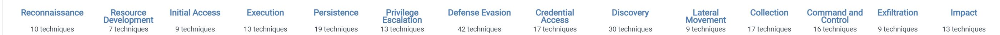

# InfoSec_h3
# Attack

### Chapter 4: Mapping the Adversary
#### Introduction

* Gathering information about potential threats is a crucial first step before attempting to track them.

* The ATT&CK Framework is a model used to study the actions and strategies of attackers that are able to penetrate systems. It categorizes the attacker's tactics, techniques, and procedures.

* Both defensive and offensive cybersecurity experts use the ATT&CK Framework as a common language and reference tool, making it easier to communicate with others in and outside the field.

* The ATT&CK Framework is open for contribution, allowing users to submit their own tactics, techniques, and procedures to be incorporated into the framework.

#### Tactics

* Each tactic in the ATT&CK Framework represents the reasoning behind the attacker's specific behavior during the intrusion.

* The framework currently defines 14 tactics, which encompass a group of techniques used by attackers.

The name of the attack with brief describtion: 

1. Reconnaissance involves gathering as much information about the target as possible.
2. Resource Development involves evaluating the target's resources, which can be acquired through purchase, theft, or development.
3. Initial Access describes the attacker's first actions in the target environment.
4. Execution covers the tactics used for executing malware in the target.
5. Persistence involves the attacker's ability to remain in the system even after the target environment has been shut down or restarted.
6. Privilege Escalation involves the attacker entering the system with a low-level account and attempting to gain higher levels of access.
7. Defense Evasion encompasses all actions taken by the attacker to avoid detection.
8. Credential Access involves stealing a user's information, such as login credentials, from the target environment and impersonating the user.
9. Discovery involves the attacker finding out as much information about the target as possible.
10. Lateral Movement involves the attacker analyzing the network configuration to reach their target.
11. Collection involves gathering data from the target.
12. Command and Control describes the techniques used by the attacker to communicate with the system.
13. Exfiltration involves the techniques used by the attacker to steal the target's data.
14. Impact encompasses the techniques and attempts to prevent access to and use of the data.

The ATT&CK Matrix provides an overview of the various tactics and techniques involved in an attack.

The matrix has 14 tactics, which serve as headers for the columns below. The columns contain the various techniques, which can be further expanded into sub-techniques by clicking on them.

#### Mapping with ATT&CK

Mapping with ATT&CK refers to the process of aligning an organization's security tools and practices with the tactics and techniques used by attackers in the cyber threat landscape. This involves identifying the coverage gaps in an organization's defenses and making informed decisions on how to fill those gaps.

One tool that can be used for mapping with ATT&CK is the MITRE ATT&CK Navigator. It is a web-based tool that allows users to visualize their coverage of the MITRE ATT&CK framework and evaluate the efficacy of their security tools.

The MITRE ATT&CK Navigator works by providing a visual representation of the matrix that showcases the tactics and techniques used by attackers, and allows users to annotate which ones their security tools cover. Users can then use this information to evaluate their overall coverage and identify gaps that need to be filled. This can help organizations to prioritize their security investments and ensure that they are effectively protected against a wide range of cyber threats.

Another tool for mapping with ATT&CK is the ThreatConnect platform. This is a cloud-based threat intelligence platform that integrates with multiple data sources to provide a comprehensive view of an organization's security posture.
This is how it can be used: 
We need to import the ATT&CK framework into the platform. 

* Then annotate the matrix with existing security tools. Users annotate the matrix with the security tools they have in place, allowing them to see their coverage against the tactics and techniques used by attackers. 

* After Identify gaps in coverage by visualizing the coverage gaps. Users will identify areas where they need to improve their security posture, either by investing in new tools or enhancing their existing ones.

Then we can plan and execute remediation. With the visibility provided by ThreatConnect, it is possible to plan and execute remediation actions to fill coverage gaps, ensuring that organization is protected against the latest threats.

Finally, monitoring the progress, where Users can track the progress of their remediation efforts and receive notifications when new threats emerge that require action. This helps to keep the organization's security posture up-to-date and aligned with the latest threats.

### MITRE ATT&CK

#### Define tactic and give an example

One tactic in the MITRE ATT&CK framework is "Defense Evasion". This tactic encompasses techniques used by attackers to evade detection by the victim's security controls and hide their activities. Some techniques within the Defense Evasion tactic include:

* Disabling or stopping security services
* Hiding files or processes
* Modifying system level permissions
* Masking command and control traffic as benign network communication

#### Define technique and subtechnique, and give an example of each

Technique in the MITRE ATT&CK framework refers to specific action or behavior that an attacker may use to carry out a tactic.

For example, one tactic within the "Defense Evasion" is "File Deletion". This technique involves the attacker removing or destroying data on the victim system to hide their tracks and prevent discovery.

Sub-technique s further refinement of a technique that provides more specific details on the attacker's behavior.

For example, within the "File Deletion" technique, a sub-technique could be "File Deletion using SDelete". This sub-technique involves the attacker using the SDelete tool to securely delete files and hide their activities.

#### Define procedure, and give an example of each

A procedure is a set of steps that need to be followed to perform a specific task or achieve a particular outcome. Procedures are usually documented and followed in order to ensure consistent results and to avoid errors.

A procedure in a security context could be a series of steps that must be followed to ensure the safe handling of sensitive data. This could include steps such as:

* encrypting the data, 
* transmitting it over a secure network, 
* storing it in a secure location. 

Other examples of procedures might include the steps involved in performing a software update, or the steps involved in responding to a security breach.

### Webgoat: A3 Sensitive data exposure
#### Insecure Login: 2 Let's try

To start the practise, I turned on the WebGoat: 

       java -jar webgoat-server-8.0.0.M26.jar
       
Since, I already had a packet sniffer installed in my system by default, I decided to first upgraded it and then start: 

       sudo apt install wireshark
       
       sudo wireshark
       
       
